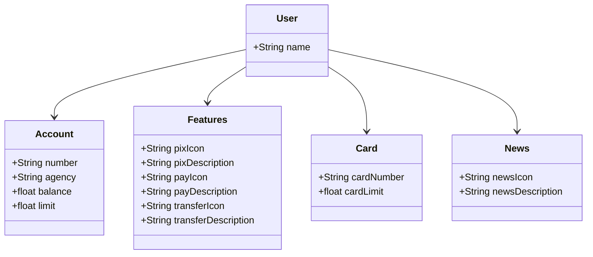

# API Restful Completamente feita com Java

## Diagrama de Classes

```mermaid
classDiagram
    class User {
        +String name
    }

    class Account {
        +String number
        +String agency
        +float balance
        +float limit
    }

    class Features {
        +String pixIcon
        +String pixDescription
        +String payIcon
        +String payDescription
        +String transferIcon
        +String transferDescription
    }

    class Card {
        +String cardNumber
        +float cardLimit
    }

    class News {
        +String newsIcon
        +String newsDescription
    }

    User --> Account
    User --> Features
    User --> Card
    User --> News
```
